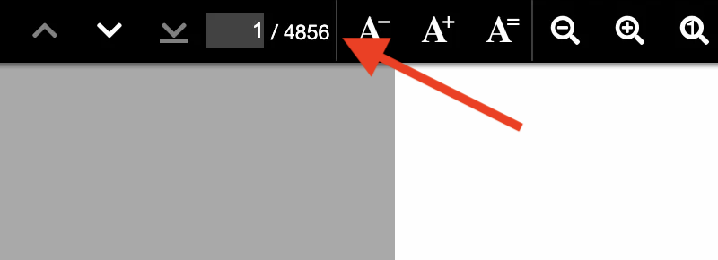

このリポジトリは Vivliostyle の動作に関する報告のためのものです。

`@vivliostyle/cli` の `5.5.1` 上で動作していた CSS を使用すると、`9.8.4` ではページ数が無限に増えていくような動作が観測されました。
サンプルに含まれる CSS はできるだけ未使用部分を削除したものです。

## サンプル 1

動作を再現できるものです。



```
yarn vivliostyle preview -c ./example1/vivliostyle.config.js
```

## サンプル 2

これが原因かわかりませんが `clear: both` をやめると改善するようです。

```
yarn vivliostyle preview -c ./example2/vivliostyle.config.js
```
